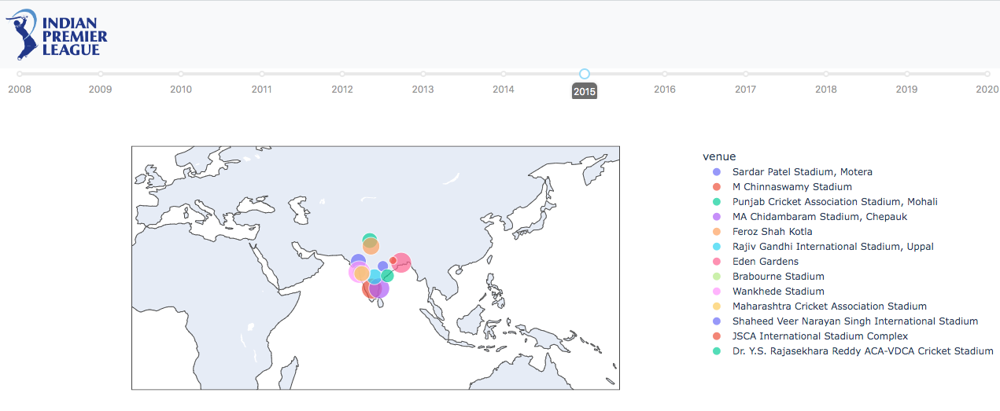
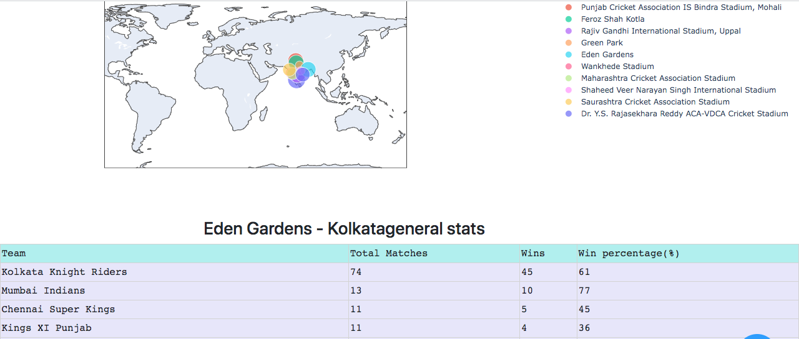
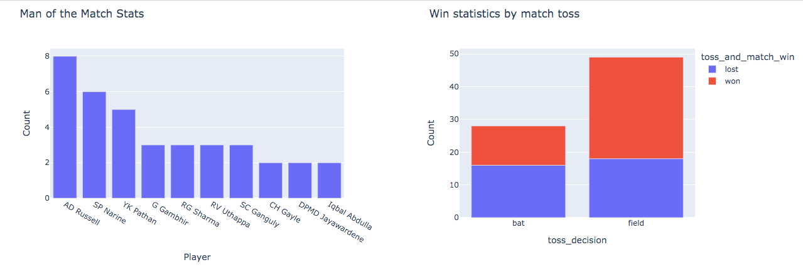
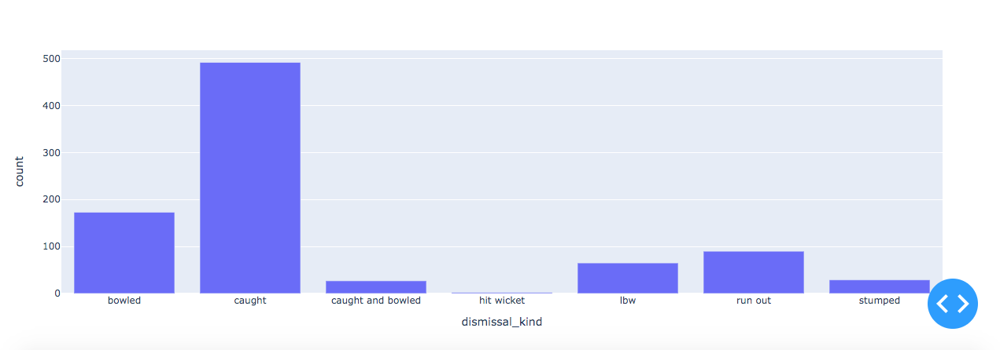

# IPL dashboard with DASH (2008 - 2020)

## About the dashboard

This is a simple dashboard to see stadium related statistics of all IPL matches through the years 2008 to 2020. Presented with a timeline and a world map showcasing stadiums, this easy to use dashboard gives you critical insights to stadium conditions where these matches were played. An ideal presentation for coaches and statiscians to gather information of the stadium conditions to prepare for a match.

### Timeline and world map presentation

On the dashboard's main page, we may select the year and stadium to view associated statistics.

### Victory percetages of teams on individual grounds

Here, coaches may check the victory percentages of the teams who play on this field, and home coaches can know who their hardest opponents are in order to better prepare for such games.

### Best players and toss statistics on individual grounds

Team owners can see good performing players on this ground and can plan their transfer budget for the next season. The victory % of the side batting first or second could also be seen by away coaches, and captains could make educated decisions on the toss.

### Method of dismissal

Team coaches could analyze the method of dismissals on each ground and take a educated decision on the best team combination for that game. In the above image we see that the most number of wickets have come via catches. This could be a hint for coaches to have more spinners on the field.

## Project setup
  - conda create -y python=3.9 --name dv
  - conda activate dv
  - pip install -r requirements.txt

## Run Dashboard
  - run command - python main.py
